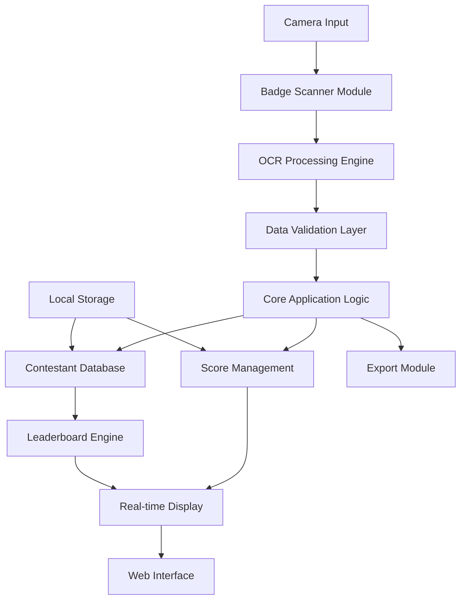

# Gola Score Keeper - Implementation Guide

## Table of Contents
1. [Project Overview and Objectives](#project-overview-and-objectives)
2. [High-level Architecture](#high-level-architecture)
3. [Key Components and Modules](#key-components-and-modules)
4. [Implementation Phases](#implementation-phases)
5. [Technology Stack Recommendations](#technology-stack-recommendations)
6. [Success Criteria](#success-criteria)
7. [Risk Assessment](#risk-assessment)
8. [Timeline Estimates](#timeline-estimates)
9. [Getting Started](#getting-started)
10. [Development Guidelines](#development-guidelines)

## Project Overview and Objectives

### Project Summary
Gola Score Keeper is a real-time soccer penalty shot scoring application designed for trade show environments. The system captures contestant information via badge scanning and tracks penalty shot performance for booth engagement analytics.

### Primary Objectives
- **Real-time Badge Scanning**: Capture contestant information using MacBook Air camera
- **Score Tracking**: Record and display penalty shot results
- **Leaderboard Management**: Maintain competitive rankings
- **Data Analytics**: Generate engagement reports for post-event analysis
- **User Experience**: Provide intuitive interface for booth operators

### Business Requirements
- **BR-001**: System must operate offline during event
- **BR-002**: Support minimum 200 contestants per day
- **BR-003**: Badge scanning completion time < 5 seconds
- **BR-004**: Real-time score updates and leaderboard refresh
- **BR-005**: Export contestant data for CRM integration

### Functional Requirements
- **FR-001**: Scan and parse badge information (name, company, contact)
- **FR-002**: Record penalty shot attempts and results
- **FR-003**: Display current contestant information
- **FR-004**: Maintain historical leaderboard
- **FR-005**: Generate daily summary reports

### Non-Functional Requirements
- **NFR-001**: Response time < 2 seconds for all operations
- **NFR-002**: 99.9% uptime during event hours
- **NFR-003**: Support 50+ concurrent booth operators
- **NFR-004**: Cross-platform compatibility (macOS Apple Silicon)
- **NFR-005**: GDPR compliance for data handling
- **NFR-006**: Memory usage < 200MB baseline (Apple Silicon optimized)
- **NFR-007**: Badge scanning < 5 seconds (baseline requirement)

## High-level Architecture



### Architecture Principles
- **Modular Design**: Loosely coupled components for maintainability
- **Offline-First**: Local data storage with optional cloud sync
- **Real-time Updates**: Event-driven architecture for live updates
- **Scalable Storage**: Efficient data structures for performance

## Key Components and Modules

### 1. Camera Interface Module
```go
// Responsibilities:
// - Camera initialization and configuration
// - Image capture and preprocessing
// - Frame rate optimization for Apple Silicon
```

**Key Features:**
- Native macOS camera API integration
- Image quality optimization
- Error handling for camera failures

### 2. OCR Processing Engine
```go
// Responsibilities:
// - Badge text extraction
// - Data parsing and structuring
// - Confidence scoring for accuracy
```

**Key Features:**
- Tesseract OCR integration
- Custom badge format recognition
- Multi-language support

### 3. Contestant Management System
```go
// Responsibilities:
// - Contestant registration and validation
// - Duplicate detection
// - Data persistence
```

**Key Features:**
- SQLite local database
- Data validation rules
- CRUD operations

### 4. Score Tracking Engine
```go
// Responsibilities:
// - Penalty shot recording
// - Performance calculations
// - Historical data management
```

**Key Features:**
- Real-time score updates
- Statistical analysis
- Performance metrics

### 5. Web Interface Layer
```go
// Responsibilities:
// - Operator dashboard
// - Live leaderboard display
// - Administrative controls
```

**Key Features:**
- Responsive design
- WebSocket for real-time updates
- Touch-friendly interface

### 6. Export and Reporting Module
```go
// Responsibilities:
// - Data export (CSV, JSON)
// - Report generation
// - Analytics dashboard
```

**Key Features:**
- Multiple export formats
- Scheduled exports
- Custom report templates

## Implementation Phases

### Phase 1: Core Infrastructure (Week 1-2)
**Deliverables:**
- [ ] Project setup and structure
- [ ] Camera interface implementation
- [ ] Basic OCR integration
- [ ] Local database schema
- [ ] Unit test framework

**Acceptance Criteria:**
- Camera successfully captures images
- OCR extracts text with >80% accuracy
- Database operations complete successfully

### Phase 2: Badge Processing (Week 3-4)
**Deliverables:**
- [ ] Badge format recognition
- [ ] Data parsing algorithms
- [ ] Validation rules implementation
- [ ] Error handling mechanisms
- [ ] Integration testing

**Acceptance Criteria:**
- Badge scanning completes within 5 seconds
- Data validation catches 95% of errors
- System handles malformed badges gracefully

### Phase 3: Score Management (Week 5-6)
**Deliverables:**
- [ ] Score recording functionality
- [ ] Leaderboard calculations
- [ ] Real-time updates
- [ ] Performance metrics
- [ ] Data persistence

**Acceptance Criteria:**
- Scores update in real-time
- Leaderboard rankings are accurate
- Historical data is preserved

### Phase 4: User Interface (Week 7-8)
**Deliverables:**
- [ ] Web-based dashboard
- [ ] Operator controls
- [ ] Live display screens
- [ ] Mobile responsiveness
- [ ] User experience testing

**Acceptance Criteria:**
- Interface is intuitive for operators
- Real-time updates display correctly
- System works on various screen sizes

### Phase 5: Integration & Testing (Week 9-10)
**Deliverables:**
- [ ] End-to-end testing
- [ ] Performance optimization
- [ ] Security implementation
- [ ] Documentation completion
- [ ] Deployment preparation

**Acceptance Criteria:**
- All functional requirements met
- Performance benchmarks achieved
- Security vulnerabilities addressed

## Technology Stack Recommendations

### Backend Framework
```go
// Primary: Go 1.21+ with Gin Web Framework
// Rationale: Native performance, excellent concurrency
// Apple Silicon optimization available
```

### Database
```sql
-- SQLite 3.40+
-- Rationale: Embedded, zero-config, reliable for event use
-- Supports concurrent reads, sufficient for use case
```

### OCR Engine
```bash
# Tesseract 5.0+ with Go bindings
# Alternative: Apple Vision Framework via CGO
# Rationale: Proven accuracy, extensive language support
```

### Frontend Technology
```javascript
// HTML5 + Vanilla JavaScript + WebSockets
// Framework: Lightweight vanilla JS or Alpine.js
// Rationale: Minimal dependencies, fast loading
```

### Camera Integration
```go
// AVFoundation via CGO bindings
// Alternative: OpenCV Go bindings
// Rationale: Native macOS integration, optimal performance
```

### Build and Deployment
```yaml
# Docker for containerization
# GitHub Actions for CI/CD
# Native macOS binary compilation
```

## Success Criteria

### Technical Success Metrics
- **Performance**: Badge scanning < 5 seconds, UI response < 2 seconds
- **Reliability**: 99.9% uptime during 8-hour event days
- **Accuracy**: OCR accuracy > 90% for standard badges (95%+ with Neural Engine)
- **Scalability**: Handle 200+ contestants without performance degradation
- **Resource Usage**: Memory < 200MB baseline, CPU < 10% during normal operation

### Business Success Metrics
- **User Adoption**: 90% of booth visitors participate
- **Data Quality**: <5% manual data correction required
- **Operator Satisfaction**: Positive feedback from booth staff
- **Lead Generation**: Complete contact information for 80% of participants

### Quality Assurance Criteria
- **Code Coverage**: Minimum 80% test coverage
- **Documentation**: Complete API documentation and user guides
- **Security**: No data breaches, GDPR compliance verified
- **Maintainability**: Code review approval, clean architecture

## Risk Assessment

### High Risk Items
| Risk | Impact | Probability | Mitigation Strategy |
|------|---------|-------------|-------------------|
| OCR accuracy insufficient | High | Medium | Implement multiple OCR engines, manual override capability |
| Camera hardware failure | High | Low | Backup camera device, graceful degradation mode |
| Performance issues on Apple Silicon | Medium | Medium | Early testing, performance profiling, optimization |

### Medium Risk Items
| Risk | Impact | Probability | Mitigation Strategy |
|------|---------|-------------|-------------------|
| Badge format variations | Medium | High | Flexible parsing algorithms, configuration options |
| Network connectivity issues | Medium | Medium | Offline-first design, local data storage |
| User interface complexity | Medium | Low | User testing, iterative design improvements |

### Low Risk Items
| Risk | Impact | Probability | Mitigation Strategy |
|------|---------|-------------|-------------------|
| Database corruption | Low | Low | Regular backups, transaction safety |
| Third-party dependency issues | Low | Medium | Vendor lock-in avoidance, fallback options |

### Risk Monitoring
- **Weekly risk reviews** during development
- **Contingency plans** for critical path items
- **Stakeholder communication** for high-impact risks

## Timeline Estimates

### Development Schedule (10 weeks)
```gantt
title Gola Score Keeper Development Timeline
dateFormat  YYYY-MM-DD
section Phase 1
Core Infrastructure    :2024-01-01, 14d
section Phase 2
Badge Processing      :2024-01-15, 14d
section Phase 3
Score Management      :2024-01-29, 14d
section Phase 4
User Interface        :2024-02-12, 14d
section Phase 5
Integration & Testing :2024-02-26, 14d
```

### Milestone Schedule
- **Week 2**: Core infrastructure demo
- **Week 4**: Badge scanning prototype
- **Week 6**: Score tracking MVP
- **Week 8**: Complete UI implementation
- **Week 10**: Production-ready system

### Resource Allocation
- **Lead Developer**: 40 hours/week (full-time)
- **UI/UX Designer**: 20 hours/week (part-time)
- **QA Tester**: 15 hours/week (part-time)
- **Project Manager**: 10 hours/week (oversight)

## Getting Started

### Prerequisites
```bash
# macOS Monterey 12.0+ (Apple Silicon)
# Go 1.21+
# Xcode Command Line Tools
# Homebrew package manager
```

### Initial Setup
```bash
# 1. Clone repository
git clone https://github.com/yourorg/gola-score-keeper.git
cd gola-score-keeper

# 2. Install dependencies
brew install tesseract
go mod download

# 3. Initialize database
go run cmd/setup/main.go

# 4. Run development server
go run cmd/server/main.go
```

### Project Structure
```
gola-score-keeper/
├── cmd/
│   ├── server/          # Main application entry
│   └── setup/           # Database initialization
├── internal/
│   ├── camera/          # Camera interface
│   ├── ocr/            # OCR processing
│   ├── models/         # Data models
│   ├── handlers/       # HTTP handlers
│   └── database/       # Database operations
├── web/
│   ├── static/         # CSS, JS, images
│   └── templates/      # HTML templates
├── tests/              # Test files
├── docs/               # Documentation
└── deployments/        # Docker, scripts
```

## Development Guidelines

### Code Standards
- **Go Style Guide**: Follow official Go formatting
- **Error Handling**: Explicit error checking, no panics
- **Testing**: Unit tests for all public functions
- **Documentation**: GoDoc comments for all exports

### Git Workflow
```bash
# Feature branch workflow
git checkout -b feature/badge-scanning
git commit -m "feat: implement badge OCR processing"
git push origin feature/badge-scanning
# Create pull request for review
```

### Quality Gates
- [ ] All tests passing
- [ ] Code review approval
- [ ] Performance benchmarks met
- [ ] Documentation updated
- [ ] Security scan passed

---

**Project Contact**: [Your Name] - [email@company.com]  
**Repository**: [GitHub Repository URL]  
**Documentation**: [Documentation URL]  
**Last Updated**: [Current Date]